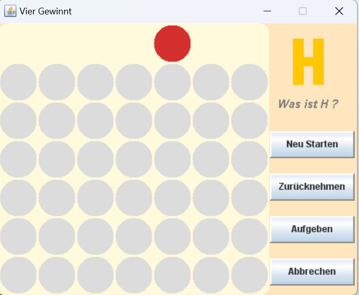

# vierGewinnt
A board game always stimulates their creativity!
Four Wins is a two-person strategy game. Try to defeat your opponent! Even you can challenge different AI programmes.

Connect Four is a two-person strategy board game. A player drops a piece into a column and this piece occupies the lowest free space in the column. The winner is the player who first manages to line up four or more of his pieces horizontally, vertically, or diagonally, Even you can challenge different AI programs. 

Rules and strategy
A player drops a piece into a column and this piece occupies the lowest free space in the column. The winner is the player who first manages to line up four or more of his pieces horizontally, vertically or diagonally.

